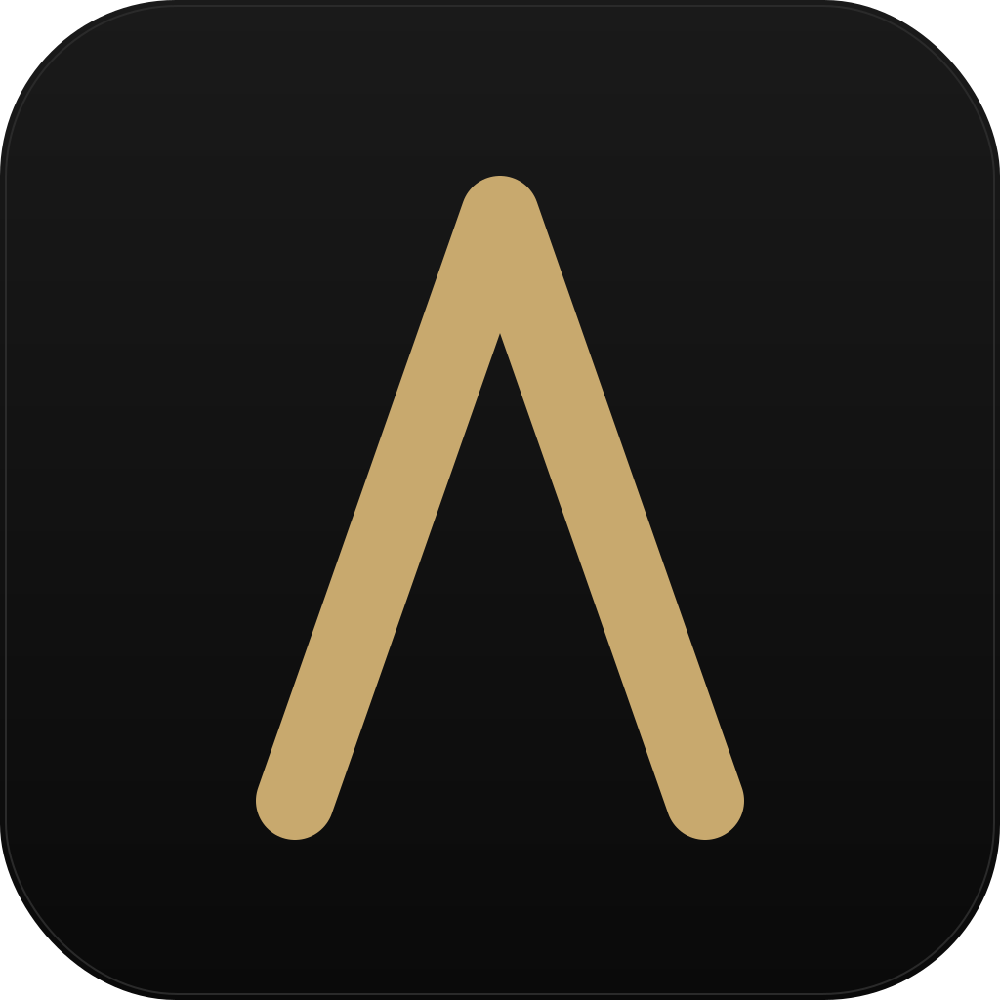

# Λ Logos

> Minimal desktop chat app for local LLMs via Ollama — with multi-provider web search, URL & YouTube reading, file attachments, persistent memory, Open Notebook integration, and ComfyUI image generation.

**Click an icon, get a chat window.** No accounts, no cloud, no telemetry. Your config, chats, memory, and generated images live on your machine.



---

## Features

- **Local LLMs via Ollama** — any model you've pulled (text, vision, code), including `:cloud` models. Capabilities are auto-detected so the UI adapts (image attachments, etc.).
- **Multi-provider web search** — choose **DuckDuckGo** (zero setup), **Brave Search API** (your key), or self-hosted **SearXNG**. With smart auto-routing (the LLM decides when to search) and context-aware query reformulation so follow-ups like "and how about Madrid?" expand into self-contained queries.
- **URL reading** — paste any URL and Logos fetches & extracts clean text via `trafilatura`. **YouTube** URLs route through `youtube-transcript-api` for full timestamped transcripts (Greek/English priority, then any).
- **File attachments** — text, code, PDF, DOCX always; images when the model has `vision` capability. Audio/video extensions are recognized but require model support.
- **Persistent cross-chat memory** — automatic background extraction of facts about you after each chat (name, preferences, work, hobbies, etc.), plus manual triggers (`/remember ...`, `remember: ...`, or Greek `να θυμάσαι ότι ...`). View & delete from Settings → Memory.
- **Open Notebook integration** — connect to a [self-hosted Open Notebook](https://github.com/lfnovo/open-notebook) instance, pick an active notebook, and Logos grounds every chat in that notebook's sources (full-text injection with token estimation).
- **ComfyUI image generation** — connect to any local or networked ComfyUI (`http://localhost:8188` or your home machine's IP). Built-in SDXL workflow + paste-your-own custom workflow with placeholder substitution. Auto-discovers checkpoints/samplers/schedulers. Optional LLM commentary after generation.
- **Chat history sidebar** — grouped by date (Today / Yesterday / Last 7 days / Older), rename, native-dialog export as JSON, delete.
- **Per-message actions** — copy markdown, regenerate from any point in the history.
- **Sources panel** — every reply that used web/URL/notebook context shows clickable numbered footnotes `[1]…[N]`.
- **Streaming responses** — SSE token-by-token, UTF-8-safe (Greek, emoji, anything multi-byte).
- **Dark / terminal aesthetic** — `JetBrains Mono` accents, gold (#c8a96e) highlight on near-black, splash screen during startup.

---

## Install (Debian / LMDE / Ubuntu)

```bash
sudo apt install ./logos_1.1.0_all.deb
```

The package handles GTK/WebKit system deps via `Depends`. Python packages are pip-installed by the `postinst` script (uses `--break-system-packages`).

After install: open your application menu → **Logos**.

To uninstall:
```bash
sudo apt remove logos
```
(Your data in `~/.config/logos/` and `~/.local/share/logos/` is preserved.)

---

## Prerequisites

**Required:**
- **Ollama** running locally with at least one pulled model — https://ollama.com

**Optional (each unlocks a feature):**
- **SearXNG** — if you want to use SearXNG instead of DuckDuckGo / Brave. Must have JSON format enabled in `settings.yml`:
  ```yaml
  search:
    formats:
      - html
      - json
  ```
- **Brave Search API key** — https://api.search.brave.com/ (free tier: 2,000 queries/month)
- **Open Notebook** — https://github.com/lfnovo/open-notebook (REST API on port 5055 by default)
- **ComfyUI** — https://github.com/comfyanonymous/ComfyUI (port 8188 by default)

All endpoints are configurable from the Settings panel.

---

## First-run setup

1. Open Logos.
2. Click ⚙ (top-right) → **Settings**.
3. **Model tab**: set Ollama host (default `http://localhost:11434`), pick your model, set your location (used in system prompt so the model knows where you are — e.g., "Athens, Greece").
4. **Search tab**: leave default (DuckDuckGo) or configure Brave / SearXNG.
5. **Image tab** (optional): point at your ComfyUI URL, hit Connect, pick a checkpoint.
6. **Notebook tab** (optional): point at your Open Notebook URL, hit Connect, pick an active notebook.
7. Save.

That's it. Click ⊕ (top-right) for a new chat, type, hit Enter.

---

## Usage

| Action | How |
|---|---|
| Send message | Type → Enter |
| Newline in input | Shift+Enter |
| Toggle force web search | 🔍 button (gold border = ON for next sends) |
| Attach files | 📎 button → native picker (multi-select) |
| Generate image | 🎨 button → modal → Generate |
| New chat | ⊕ in header |
| Open chat history | ☰ in header (slide-in panel) |
| Rename chat | ✎ on hover in history |
| Export chat (JSON) | ↓ on hover in history (native save dialog) |
| Delete chat | ✕ on hover in history |
| Copy a reply | ⎘ Copy under any assistant message |
| Regenerate | ↻ Regenerate (truncates from that point, regenerates) |
| Zoom an image | Click on the image |
| Manual memory save | Type `/remember ...`, `remember: ...`, or Greek `να θυμάσαι ότι ...` |
| View / edit memory | Settings → Memory tab |
| Set active notebook | Settings → Notebook → connect → pick from dropdown |
| Refresh notebook (after editing it externally) | ↺ button next to the dropdown |

---

## Settings tabs

| Tab | What's there |
|---|---|
| **Model** | Ollama host, model dropdown, temperature, your location |
| **Search** | Provider (DDG / Brave / SearXNG), provider-specific fields, results count, auto-search toggle |
| **System Prompt** | Editable system prompt (full-height textarea) |
| **Notebook** | Open Notebook API + UI URLs, active notebook dropdown, token estimate, refresh button |
| **Image** | ComfyUI URL, workflow (preset or custom JSON), checkpoint/sampler/scheduler dropdowns (auto-populated), dimensions, steps, CFG, negative prompt, post-gen commentary toggle |
| **Memory** | List of saved facts with delete buttons |

---

## Data locations

| What | Where |
|---|---|
| Config | `~/.config/logos/config.json` |
| Chats | `~/.local/share/logos/chats/<uuid>.json` |
| Memory | `~/.local/share/logos/memory.json` |
| Generated images | `~/.local/share/logos/images/<chat_id>/<timestamp>_<seed>.png` |

When a chat is deleted from the sidebar, its associated images are also cleaned up.

If you previously used the development name (`chat_app`), Logos auto-migrates your data on first run.

---

## Architecture (one-line)

Python Flask backend + vanilla HTML/JS frontend, wrapped in a native window via `pywebview` (GTK+WebKit2). One process. No build step for the UI.

For module-level details, contributing, or asking an LLM to extend the app, see [developers.md](developers.md).

---

## License

MIT.

---

## Credits

- Web extraction: [trafilatura](https://github.com/adbar/trafilatura)
- YouTube transcripts: [youtube-transcript-api](https://github.com/jdepoix/youtube-transcript-api)
- Web search: [ddgs](https://github.com/deedy5/duckduckgo_search), [Brave Search API](https://api.search.brave.com/), [SearXNG](https://docs.searxng.org/)
- PDF parsing: [pypdf](https://github.com/py-pdf/pypdf)
- DOCX parsing: [python-docx](https://github.com/python-openxml/python-docx)
- Knowledge base: [Open Notebook](https://github.com/lfnovo/open-notebook)
- Image generation: [ComfyUI](https://github.com/comfyanonymous/ComfyUI)
- Native window: [pywebview](https://pywebview.flowrl.com/)
- Markdown rendering: [marked.js](https://marked.js.org/), [highlight.js](https://highlightjs.org/)
- Local LLM runtime: [Ollama](https://ollama.com)
